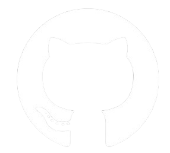

<h1 align="center">Hi there!  I'm <a href="https://github.com/your-username">Ratinderdeep Singh</a></h1>

  A Tech Enthusiast Exploring AI, Machine Learning, and Tech Solutions! 💻

---

<h2 align="left">About Me</h2>

  

- 🎓 Currently pursuing BTech @NITJ
- 🌐 Passionate about AI & Machine Learning
- ⚙️ Love building innovative projects
- 🚀 Always eager to learn and collaborate
- 💡 Open to exploring and contributing to exciting tech ventures

---

<h2 align="left">My Skills ⚒️</h2>

  
  
  
  
  
  
   
  
  
  
  
  
   
  
  
  
  
  
   
  
  
  
  
  
  
  

---

<h2 align="left">Connect with me 😊</h2>

  
  
  
  
  
  

---

<h2>Github's Stats </h2>

  

